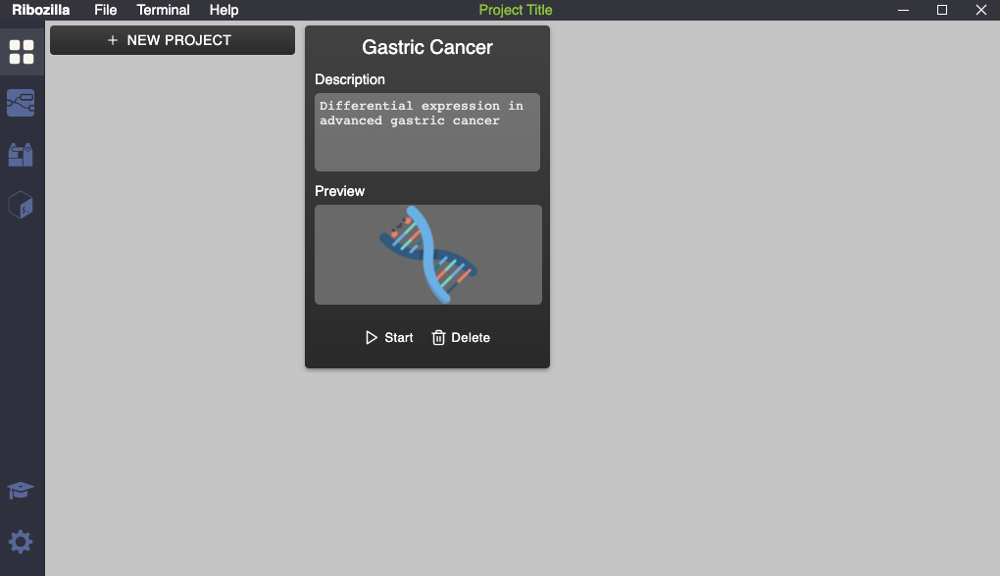
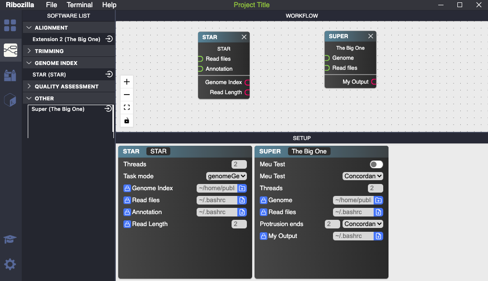

<h1 align="center">
  
   <br>
  Ribozilla
  <br>
  <h4 align="center">Flexible architecture for RNA-Seq pipeline development</h4>
</h1>
  <div align="center">
    <a target="_blank" href="https://github.com/wapablos/ribozilla">
      
    </a>
    <a target="_blank" href="https://github.com/wapablos/ribozilla">
      
    </a>
    <a target="_blank" href="https://github.com/wapablos/ribozilla">
      
    </a>
    <a target="_blank" href="https://github.com/wapablos/ribozilla">
      
    </a>
     <a target="_blank" href="https://github.com/wapablos/ribozilla">
      
    </a>  
    <br>
</div>
</p>
<br>

## Table of contents

* [Introduction](#introduction)
* [Pre-requisites](#pre-requisites)
* [Platforms](#platforms)
* [Get the source code](#get-the-source-code)
* [Building](#building)
* [Development](#development)
* [Screenshots](#screenshots)
## Introduction

**Ribozilla** is a GUI-based flexible architecture to develop RNA-Seq pipelines and setup analysis.

Ribozilla has own **CLI to GUI Converter API**, that takes CLI software parameters to be used in GUI to be setup and generates the scripts to run  based on inputs. It works in Mac, Linux and Windows.

## Platforms
You should be able to build Ribozilla on the following platforms:

* Windows 10
* macOS Sierra and later
* Linux

## Pre-requisites

* [Git](https://git-scm.com/)
* [Node.js](https://nodejs.org/en/) `x64` version `>= 12.14.1`
* [Yarn](https://classic.yarnpkg.com/en/docs/install)
* [Python](https://www.python.org/) `x64` version `>= 3.6.x`

## Get the source code

  You can get the source code cloning the repository using the following command:

    git clone https://github.com/wapablos/ribozilla.git
    cd ribozilla
    git submodule update --init

## Building
Build software base and clui API
```
$ cd ribozilla
$ yarn install-dev
```

Then, build the extensions
```
$ cd extensions
$ yarn install && yarn build
```

## Development
You can use any CLI software inside Ribozilla, using the `ribozilla-clui-api` to create it.

## Screenshots
  Projects Management      |  Pipelines Development 
:-------------------------:|:-------------------------:
 |  


