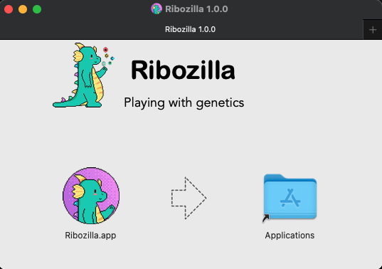

# Instalação

Você já deve ter lido sobre o Ribozilla, agora vamos aprender a instalar. Pra isso vá em [Downloads](https://ribozilla.netlify.app/downloads) e baixe a última versão para sua máquina

## Requisitos mínimos
- Armazenamento `512MB`
- Memória RAM `2GB`
- Processador  `Intel Dual Core ou equivalente`

## Windows
- A versão para Windows é disponibilizada em um arquivo EXE. Clique duas vezes para abrir o instalador.
- Clique em Executar para prosseguir a instalação.
<p align="center">
  
</p>

- Escolha a forma de instalação, global ou local.
<p align="center">
  
</p>

- E agora selecione um diretório de instalação.
<p align="center">
  
</p>

- Se tudo ocorreu bem, será exibido a mensagem abaixo e o Ribozilla estará pronto para ser usado.
<p align="center">
  
</p>


## Mac
- A versão para Mac é disponibilizada em um arquivo DMG. Clique duas vezes para montar o arquivo.
- Um janela, como a abaixo, irá abrir.

<p align="center">
  
</p>

- Então é só arrastar o **Ribozilla.app** na pasta ao lado.
- O aplicativo ficará disponível no menu de aplicações.

## Linux

Dependendo de sua distribuição linux a forma de instalação muda. AppImage é recomendado.  
Utilizando o terminal no diretório onde está o seu arquivo.

import Tabs from '@theme/Tabs';
import TabItem from '@theme/TabItem';

<Tabs
  defaultValue="debian"
  values={[
    {label: 'Debian', value: 'debian'},
    {label: 'Arch Linux', value: 'arch'},
    {label: 'AppImage', value: 'appimage'},
  ]}>
  <TabItem value="debian">

  ```shell
  $ dpkg -i ribozilla_1.0.0_beta.0_amd64.deb
  ```
  </TabItem>
  <TabItem value="arch">

  ```shell
  $ pacman -U ribozilla_1.0.0_beta.0_amd64.pacman
  ```
  </TabItem>
  <TabItem value="appimage">

  ```shell
  Apenas dois cliques para abrir o programa
  ```
  </TabItem>
</Tabs>
