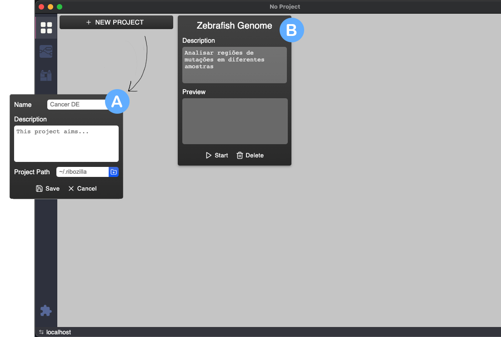
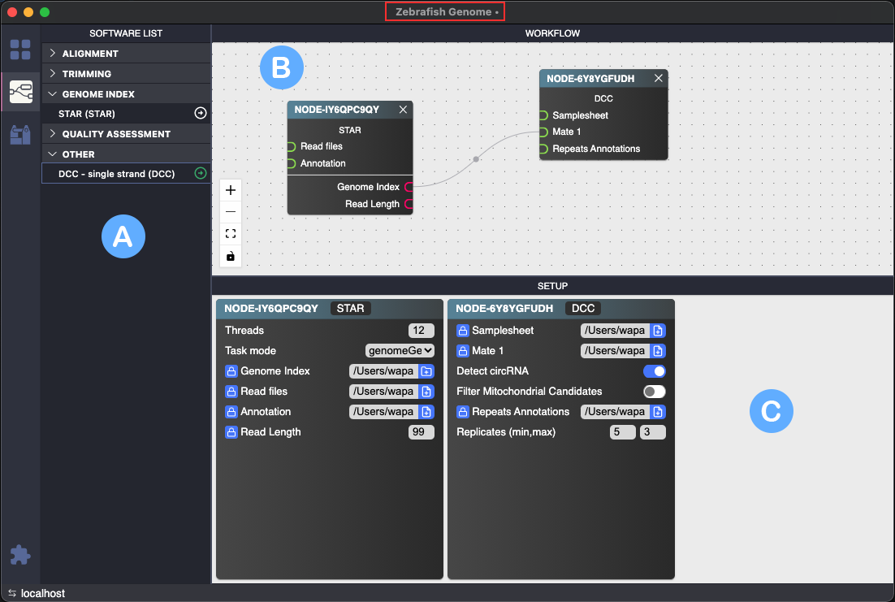

# Interface do Ribozilla

Nesta seção, vamos nos familiarizar com a interface do **Ribozilla** e ver a utilização de cada funcionalidade.

:::info
O **Ribozilla** ainda está em fase de desenvolvimento e nem todas as funcionalidades estão completas. Estão disponíveis somente as principais funcionalidades definidas no início do projeto.
:::

## Elementos da Interface
Para proseguir sua jornada com o uso do Ribozilla é essencial entender como funciona sua interface, que por sinal é bem simples.

- **(A)** A **Barra de Menu** permite acessar recursos básicos da aplicação como projeto atuais,  informações, configuração e também gerenciamento de arquivos. No MacOS, as opções são exibidas no menu global.  
- **(B)** A **Barra de Ferramentas** contém as funcionalidades da aplicação entre eles gerenciamento de **projetos**, montagem de **pipelines**, seção de **resultados** (Toolbox) e gerenciador de **extensões**. Se você pousar o mouse sobre os ícones será exibido o nome das seções.
- **(C)** O **Workspace** é a região onde é exibida de interface de cada funcionalidade.  
- **(D)** O **Barra de status** aqui é exibida as informações sobre o projetos, notificações e conexões (ainda não implementada).  

# Funcionalidades

## Projetos
A seção onde você inicia seus experimentos dando um nome e uma descrição, além de escolher um lugar onde cada projeto vai ficar.

- **(A)** Ao clicar em 'NEW PROJECT' um *card* vai aparecer requisitando informações de um novo projeto  
- **(B)** Todos os projetos criados ficarão disponíveis nessa inicial e serão sincronizados no diretório escolhido anteriormente.

:::info
Para desbloquear as outras funcionalidades é preciso inicar um projeto, com exceção a seção de **Extensões**
:::

## Pipelines
Aqui você monta seu pipeline e configura seus parâmetros utilizando os softwares (extensões) disponíveis.

- **Marcador vermelho** aponta o **projeto** que está aberto, o ponto ao lado indica que ele possui alterações e precisa ser salvo.
- **(A)** **Lista de softwares** que podem ser configurados no Ribozilla, aparecerão todas as que foram instaladas na seção de **Extensões**. Ao clicar ícone ao lado cada software ele adiciona um novo nó e consequentemente um novo card. 
- **(B)** **Editor de nós**, todos os softwares adicionados em forma de um nó que pode conter conectores de entradas de dados (verde) e de saídas (rosa).
- **(C)** **Cards**, são versões extendidas de um nó, cada nó tem seu respectivo *card*, que é o elemento que realiza a configuraçãos dos paramêtros respectivos a um comando do software escolhido. O rótulo *card* apresenta o código de seu nó respectivo e o commando do software que será configurado.

:::caution atenção
Para salvar o arquivo utilize `Ctrl+S`
:::

## Toolbox
Nesta seção todas os softwares e ajustes realizados são convertidos em um script de linha de comando, obedecendo suas flags, parâmetros e sintaxe, que foram configuradas na extensão.

- **Disquete** escolhe um local para salvar o script.
- **Lápis** edita o script.

## Extensões
Você pode adicionar em seu pipeline qualquer software que estiver disponível ou até mesmo [criar uma nova extensão](/docs/developers-guide/start-ribozilla) para uso próprio.

- **(A)** As extensões instaladas do repositório de extensões, os mesmos estão disponíveis na seção **Pipelines**.
- **(B)** As extensões disponíveis no repositório de extensões.